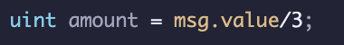
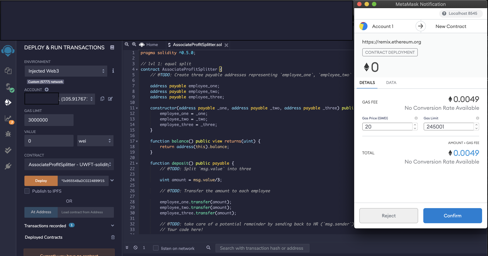
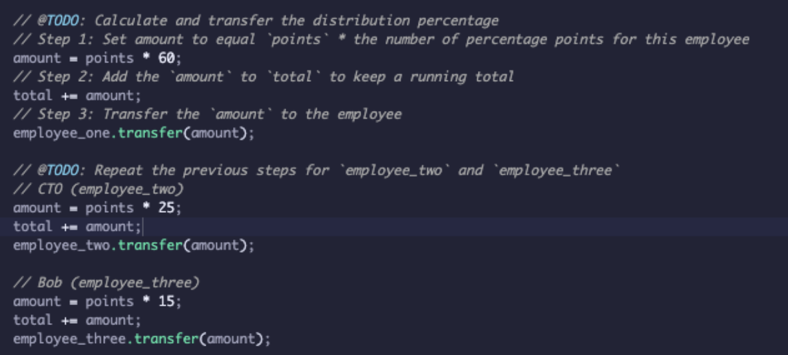
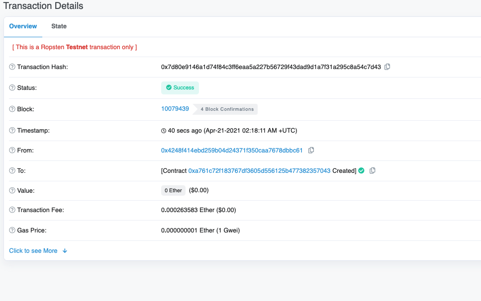

# Solidity Homework 
## by Matt Houk 

### Level One

Delivering profits to employees. In this contract, we will split the profits evenly: 

- We do this by dividing by three. 

Here it is deployed: 

### Level Two 
Delivering profits to employees. In this contract, we will split the profits by job role: 
- We do this by ranking with points and then multiply. 
- Note that we are not using safemath yet.

### Here is an example transcation on the Ropsten Network 

